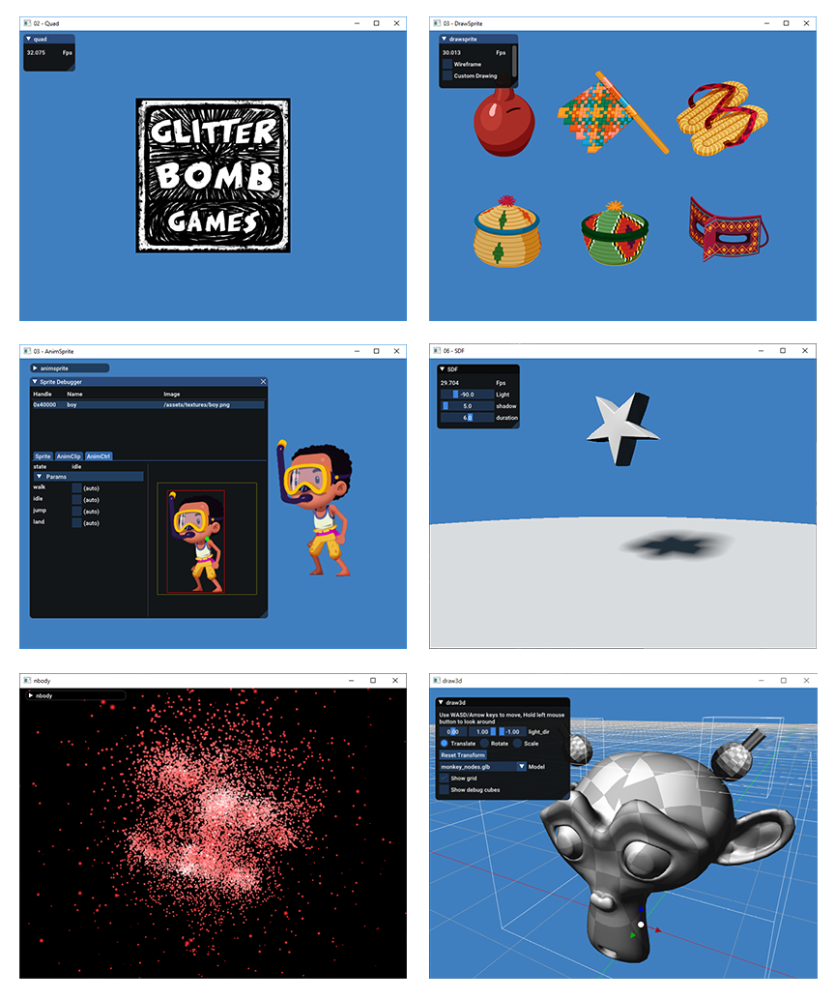

[](https://travis-ci.org/septag/rizz)

## Rizz
[@septag](https://twitter.com/septagh)  

Rizz (ریز) is a tiny, multi-platform, and minimal game/app development framework, Written in C language. Inspired by [The Machinery](https://ourmachinery.com/) and [sokol libs](https://github.com/floooh/sokol).
It's currently a work in progress, features and improvements will be added constantly to different platforms.

## Design and Basic usage
For more detailed information about design principles, architecture and basic usage of the framework, please read the document [rizz Architecture and Basic usage](http://glitterbombg.com/blog/posts/rizz-basics/)

#### Note
This is not a game engine, it's a relatively low-level framework for programmers to build their own engine/renderer/physics on top of it. The core of _rizz_ does not and will not implement any rendering techniques/physics or impose any specific entity system to the user. It just provides the basic building blocks for game developers. Other features will be implemented as plugins.
  
## Features and Changes
see [CHANGELOG](CHANGES.md) for latest changes, new features and bug fixes.

#### Core
- *Portable C code*: C11 (gcc/clang), C99 (msvc) compatible code, designed with data-oriented mindset. 
- *Plugin system*: Engine has a small core. Many functionalities are implemented through plugins.
- *Minimal Dependencies*: No external/large dependencies. Only a handful of small dependencies included in the source.
- *Hot-reloading of C/C++ code*: Plugins/Game code are all hot-reloadable with some restrictions and rules.
- *Fiber based job system*: Simple to use fiber-based job system.
- *Reflection*: Provides simple reflection system for _structs_, _enums_ and _functions_.
- *Async Asset Manager*: Flexible reference counting asset manager. New asset types can be added by third-party code to the manager.
- *Hot-reloading of assets and shaders*: All in-game resources and shaders can be hot-reloaded.
- *Virtual file system*: Async read/write. Directories or archives can be mounted as virtual directories.
- *Support for coroutines*: Coroutines can be suspended for N frames or N milliseconds.

#### Graphics
- *Multiple graphics API support*: Metal (iOS, MacOS). OpenGL-ES 2/3 (Android). Direct3D11 (Windows), OpenGL 3.3 (Linux)
- *Portable shaders*: Write shaders once in GLSL, toolset will automatically translate the shader to other APIs.
- *Multi-threaded GPU command-buffer*: Draw commands can be submitted by multiple threads with _staged_ API.
- *Compute shader support (Experimental)*: Experimental compute-shader support, currently only under Direct3D, more backends will be added.
- [basis_universal](https://github.com/BinomialLLC/basis_universal) texture format support

#### Plugins
Many of the engine features are implemented in the plugins:

- [imgui](src/imgui): Dear-imgui plugin with some utility API
- [2dtools](src/2dtools): 2D rendering tools: sprite, sprite animation, font drawing with TTF support
- [sound](src/sound): Simple sound system. Audio mixer and 2d-sounds. 
- [input](src/input): Input system with gamepad and touch support
- [3dtools](src/3dtools): 3D rendering tools: support for GLTF 3d models, basic debug primitive creation and drawing

#### Debugging and Profiling
- *Remote Profiler*: Integrated *Remotery* for remote debugger/command console and log viewer.
- *Graphics API introspection*: Debug application level graphic calls and objects.
- *Memory Debugger*: Debug and monitor memory allocations for all subsystems.

#### Supported platforms
- *Windows*
- *Linux*
- *MacOS*
- *Android*
- *RaspberryPI*
- *iOS*

## Build
_rizz_ is designed to run on all major mobile (iOS, android), PC (Windows, Linux, MacOS) and web (WebASM) platforms. 
But as the engine is in it's early age, the current platforms are built and tested: 

- __Windows__: Tested on Windows10 with visual studio 14 2015 update 3 (Win64).  
- __Linux__: Tested on ubuntu 16 with clang (6.0.0) and gcc (7.3.0). Package requirements:  
  - libx11-dev
  - libxrandr-dev
  - libxi-dev
  - libasound2-dev (if you are planning to build `sound` plugin)
- __MacOS__: Tested on MacOS High Sierra - AppleClang 9.1.0
- __Android__: For android, there is a python script [android.py](scripts/build-tools/android.py) which takes care of preparing android project structure, building the code and packaging the final APK. please read the begining of ```android.py```.
- __RaspberryPI__: Tested on RPi1 ModelB Ubuntu-jessie (gcc Raspbian 4.9.2). Package requirements:
  - libasound2-dev (if you are planning to build `sound` plugin)
- __iOS__: For iOS, there is a python script [ios.py](scripts/build-tools/ios.py) which takes care of initializing iOS project 

#### CMake options
- **BUNDLE** (default=0, android/ios=1):  
    - `BUNDLE=0` indicates that _rizz_ is built as an executable host which runs the game 
    by `rizz --run game.dll` (on linux it's `rizz --run ./game.so`). Recommended for development, 
    where you need reduced binary sizes and live-reloading of game code and plugins.  
    - `BUNDLE=1` Builds _rizz_ as static library. To link and bundle _rizz_ and other plugins with a 
    single stand-alone executable, so there will be only one executable and bundles _rizz_ and all the
    plugins you specify. to build the bundle properly, you should set these cmake arguments on configure:
		- **BUNDLE_TARGET**: target name of the executable you are trying to build (first example: `-DBUNDLE_TARGET=01-hello`)
		- **BUNDLE_TARGET_NAME**: if the _cmake_ target and the actual name of your application differs, use 
		                          argument to address that. (first example: `-DBUNDLE_TARGET_NAME=hello`)
		- **BUNDLE_PLUGINS**: list the plugins that is required by your application, separated by semicolon. 
		                      (first example: `-DBUNDLE_PLUGINS=imgui`)
								 
- **ENABLE_HOT_LOADING** (default=1, android/ios=0)
  Enables hot reloading of assets and monitoring the assets directories. Doesn't work on mobile OSes.
- **ENABLE_PROFILER** (default=0/debug, default=1/release)
- **BUILD_EXAMPLES** (default=1, android/ios=0)
  Build example projects in `/examples` directory. 
- **MSVC_STATIC_RUNTIME** (default=0): MSVC specific. Compiles the _RELEASE_ config with '/MT' flag instead of '/MD'
- **MSVC_MULTITHREADED_COMPILE** (default=1): MSVC specific. Turns on multi-threaded compilation (turns it off with Ninja)
- **CLANG_ENABLE_PROFILER** (default=0): Clang specific. Turns on `-ftime-trace` flag. Only supported in clang-9 and higher

## Examples
**Examples** Basic examples are included with this repo, in [examples](examples) directory:



**Space invaders clone** - [link to github project](https://github.com/septag/rizz-space-invaders)
  


## Open-Source libraries used
#### Primarily developed for rizz
- [sx](https://github.com/septag/sx): Portable base library
- [glslcc](https://github.com/septag/glslcc): GLSL cross-compiler *(external binary tool)*
- [dds-ktx](https://github.com/septag/dds-ktx): Single header KTX/DDS reader
- [cj5](https://github.com/septag/cj5): Very minimal single header JSON5 parser in C99, derived from jsmn
- [atlasc](https://github.com/septag/atlasc): Command-line tool that builds atlas texture from a bunch of input images. *(External binary tool)*
- [dmon](https://github.com/septag/dmon): Single header C99 portable library for monitoring directory changes.

#### 3rdparties
- [sokol](https://github.com/floooh/sokol): minimal cross-platform standalone C headers
- [cr](https://github.com/fungos/cr): Simple C Hot Reload Header-only Library
- [cimgui](https://github.com/cimgui/cimgui): C-API for imgui *(used in imgui plugin)*
- [imgui](https://github.com/ocornut/imgui): Dear ImGui: Bloat-free Immediate Mode Graphical User interface for C++ with minimal dependencies *(used in imgui plugin)*
- [Remotery](https://github.com/Celtoys/Remotery): Single C file, Realtime CPU/GPU Profiler with Remote Web Viewer
- [lz4](https://github.com/lz4/lz4): Extremely Fast Compression algorithm
- [http](https://github.com/mattiasgustavsson/libs/blob/master/http.h): Basic HTTP protocol implementation over sockets
- [stb](https://github.com/nothings/stb): stb single-file public domain libraries for C/C++
- [sort](https://github.com/swenson/sort): Sorting routine implementations in "template" C 
- [ImGuizmo](https://github.com/CedricGuillemet/ImGuizmo): 3D gizmo for imgui *(used in imgui plugin)*
- [gainput](https://github.com/jkuhlmann/gainput): Input library for games *(used in input plugin)*
- [basis_universal](https://github.com/BinomialLLC/basis_universal): Basis Universal GPU Texture Codec 
- [fontstash](https://github.com/memononen/fontstash): Light-weight online font texture atlas builder *(used in 2dtools plugin)*
- [cgltf](https://github.com/jkuhlmann/cgltf): Single-file glTF 2.0 loader and writer written in C99 *(used in 3dtools plugin)*

[License (BSD 2-clause)](https://github.com/septag/rizz/blob/master/LICENSE)
--------------------------------------------------------------------------

<a href="http://opensource.org/licenses/BSD-2-Clause" target="_blank">

</a>

	Copyright 2019 Sepehr Taghdisian. All rights reserved.
	
	https://github.com/septag/rizz
	
	Redistribution and use in source and binary forms, with or without
	modification, are permitted provided that the following conditions are met:
	
	   1. Redistributions of source code must retain the above copyright notice,
	      this list of conditions and the following disclaimer.
	
	   2. Redistributions in binary form must reproduce the above copyright notice,
	      this list of conditions and the following disclaimer in the documentation
	      and/or other materials provided with the distribution.
	
	THIS SOFTWARE IS PROVIDED BY COPYRIGHT HOLDER ``AS IS'' AND ANY EXPRESS OR
	IMPLIED WARRANTIES, INCLUDING, BUT NOT LIMITED TO, THE IMPLIED WARRANTIES OF
	MERCHANTABILITY AND FITNESS FOR A PARTICULAR PURPOSE ARE DISCLAIMED. IN NO
	EVENT SHALL COPYRIGHT HOLDER OR CONTRIBUTORS BE LIABLE FOR ANY DIRECT,
	INDIRECT, INCIDENTAL, SPECIAL, EXEMPLARY, OR CONSEQUENTIAL DAMAGES (INCLUDING,
	BUT NOT LIMITED TO, PROCUREMENT OF SUBSTITUTE GOODS OR SERVICES; LOSS OF USE,
	DATA, OR PROFITS; OR BUSINESS INTERRUPTION) HOWEVER CAUSED AND ON ANY THEORY OF
	LIABILITY, WHETHER IN CONTRACT, STRICT LIABILITY, OR TORT (INCLUDING NEGLIGENCE
	OR OTHERWISE) ARISING IN ANY WAY OUT OF THE USE OF THIS SOFTWARE, EVEN IF
	ADVISED OF THE POSSIBILITY OF SUCH DAMAGE.
