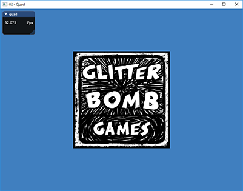
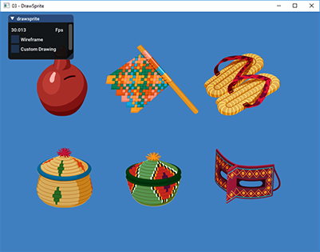
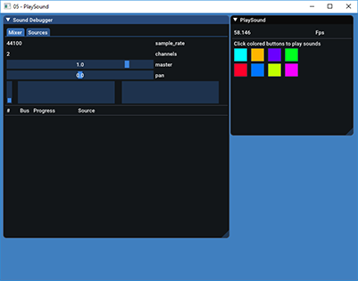
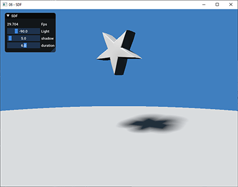
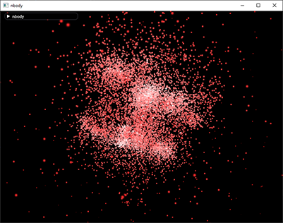
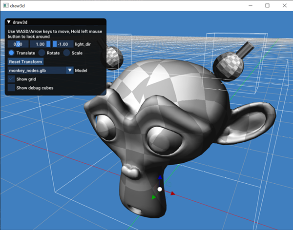
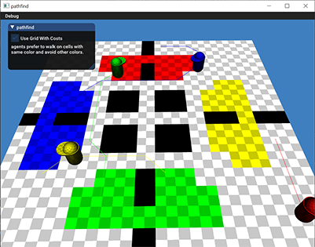
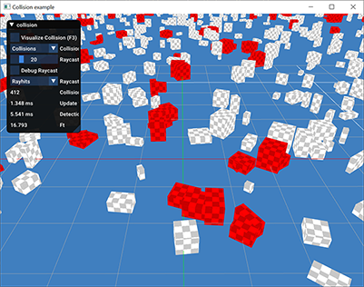
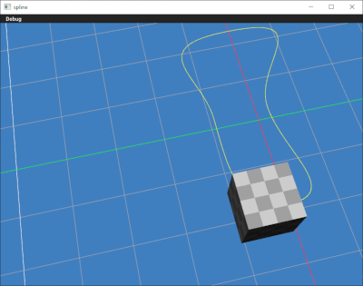
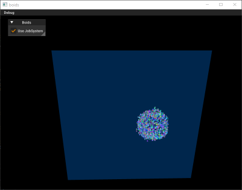

## Examples

#### [Hello](01-hello/hello.c)
Demonstrates basic application setup. Just clears the view with blue color.

#### [Quad](02-quad/quad.c)
- Most basic rendering. 
- Renders a textured quad on the screen.
- Loading shaders (shaders built with `glslcc` under `/tools` directory)
- Setting up buffers and pipelines
- Basic ortho camera setup
- Loading .basis textures
  

#### [DrawSprite](03-drawsprite/drawsprite.c)
- Load sprite atlas
- Basic sprite drawing
- Custom sprite drawing
- Wireframe mode rendering
- Basic text drawing

#### [AnimSprite](04-animsprite/animsprite.c)
- Animate sprites
- Sprite animation controller
- Sprite debugging
  

### [PlaySound](05-playsound/playsound.c)
- Loading sound files
- Play sounds
- Sound system debugger

### [SDF](06-sdf/sdf.c)
- Raymarching with SDF shapes
- Basic orbit camera (hold mouse and drag)
- Simple parametric animations

### [NBody](07-nbody/nbody.c)
- Basic compute shader usage
- GPU particle rendering with instancing 
- (Currently only build under windows/Direct3D backend)

### [Draw3d](08-draw3d/draw3d.c)
- Basic model rendering (GLTF)
- Models with sub-meshes/sub-materials
- Models with nodes and hierarchy
- Debug Grid drawing
- Debug Cube drawing

### [PathFind](09-pathfind/pathfind.c)
- Contributed by @amin67v
- Basic A* path finding 
- Path priorities/Agents with different cell weights

### [CollideBoxes](10-collideboxes/collideboxes.c)
- Basic collision detection between 2k boxes (OBB)
- Ray casting 
- Debug visualizations for collision and raycast

### [PathSpline](11-pathspline/pathspline.c)
- Demonstrate the _spline_ API presented by _utility_ plugin
- Camera movement along path

### [Boids](12-boids/boids.c)
- Contributed by @amin67v
- Boids example, demonstrates the use of job system

